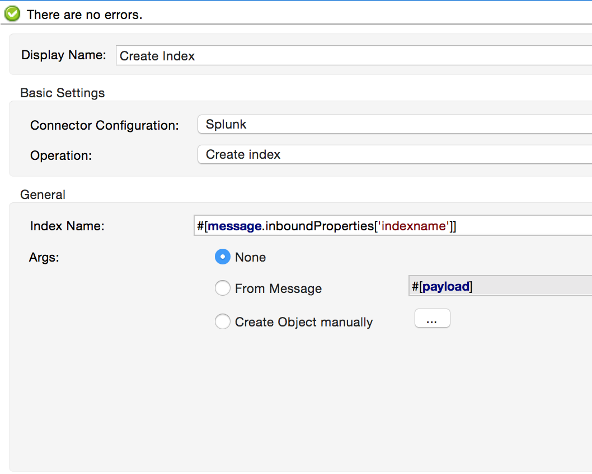

Installation and Usage
----------------------

[Purpose](#purpose)

[Prerequisites](#prerequisites)

[Getting Anypoint Studio Ready](#getting-anypoint-studio-ready)

[Setting up the project](#setting-up-the-project)

[Building the flows, Demo 1](#building-the-flows)

[Building the flows, Demo 2](#building-the-flows-demo-2)

[Other resources](#other-resources)

### Purpose

This document provides detailed instructions on how to install MuleSoft's Splunk Connector, and demonstrates how to build and run a simple demo application with AnyPoint Studio which creates an Index, sends some data to the index via HTTP, and removes the index. A second demo shows how to Create and perform a Saved Search on the Splunk Server.

### Prerequisites

In order to build and run this project you'll need:

* An instance of Splunk Enterprise, configured with some data to search on.

* [MuleSoft Anypoint Studio Community Edition](http://www.mulesoft.org/download-mule-esb-community-edition).

###Getting Anypoint Studio Ready

If you haven't installed Anypoint Studio on your computer yet, it's time to download Anypoint Studio from this location: [http://www.mulesoft.org/download-mule-esb-community-edition](http://www.mulesoft.org/download-mule-esb-community-edition). You also have the option of downloading a 30 day trial of Mule Enterprise Edition from this location [http://www.mulesoft.com/mule-esb-enterprise](http://www.mulesoft.com/mule-esb-enterprise) if you want to evaluate and purchase the premium edition. This demo can be built using either community or enterprise edition. There is no specific installation that you need to run. Once you unzip the zip file to your desired location, you are ready to go. To install the HDFS connector, you can download and install it from Anypoint Connectors Update Site. To do that:

1. Open Anypoint Studio and from "Help" menu select "Install New Software...". Installation dialog box opens - Figure below.

2. From "Work with" drop down, select "Anypoint Connectors Update Site". The list of available connectors will be shown to you.

3. Find and select the Splunk connector in the list of available connectors, the tree structure that is shown. A faster way to find a specific connector is to filter the list by typing the name of the connector in the input box above the list. You can choose more than one connector to be installed at once.

4. When you are done selecting the connectors to be installed, click on "Next" button. Details of each connector are shown on the next page. Click on "Next" button again and accept the terms of the license agreement.

5. Click on "Finish" button. The connector is downloaded and installed onto Studio. You'll need to restart the Studio for the installation to be completed.

###Setting up the project

Now that you've got your Anypoint Studio up and running, it's time to work on the Application. Create a new Mule Project by clicking on "File \> New \> Mule Project". In the new project dialog box, the only thing you are required to enter is the name of the project. You can click on "Next" to go through the rest of pages.

The first thing to do in your new app is to configure the connection to Splunk. In the message flow editor, click on the "Global Elements" tab on the bottom of the page. Then click on "Create" button on the top right of the tab. In the "Choose Global Element" type dialog box that opens select "Splunk" under "Connector Configuration" and click okay.

In the Splunk Configuration box that follows, set the Hostname and Port to the hostname and port of your Splunk Server. Note that the port defaults to 8089, and is the "admin" port, distinct from the "web" port. For example: "localhost" and "8089". Provide a username and password that is a member of a role which has access to the features you would like to use with the Connector (see the Splunk Documentation for more information).

The XML for the global element should look like this:

     <splunk:config name="Splunk" username="admin" password="password" host="localhost" port="8089" doc:name="Splunk"/>

###Building the flows, Demo 1
It's time to build the flows which creates an Index, sends some data to the index via HTTP, and removes the index.

**Create Index flow:** This is the flow which creates an index on the Splunk Server. Start by dragging an HTTP endpoint from the palette onto the flow. Configure the Host, Port and Path to "localhost", "8081", and "createindex", respectively. This is the URL you will call to start the flow.
Then drag a Splunk Connector onto the flow after the HTTP endpoint. In the configuration window for the Splunk Connector, select the previously created Splunk config from the Config Reference dropdown. Set the Operation to "Create Index", and set the Index Name to ""#[message.inboundProperties['indexname']]". Click okay.

This completes the Create Index flow.

**Send Data flow:** This is the flow which sends data to the index. Start by dragging an HTTP endpoint from the palette onto the workspace (not onto a flow), creating a new flow. Configure the Host, Port, and Path to "localhost", "8081", and "adddata", respectively. This is the URL you will call to start the flow.
Then drag a Splunk Connector onto the flow after the HTTP endpoint. In the configuration window for the Splunk Connector, select the previously created Splunk config from the Config Reference dropdown. Set the Operation to "Add data to Index", and set the Index Name field to "#[message.inboundProperties['indexname']]". Set the "String Data" field to "#[message.inboundProperties['stringdata']]". Click OK.

**Remove Index flow:** This is the flow which removes the index you created. Start by dragging an HTTP endpoint from the palette onto the workspace (not onto a flow), creating a new flow. Configure the Host, Port, and Path to "localhost", "8081", and "removeindex", respectively. This is the URL you will call to start the flow.
Then drag a Splunk Connector onto the flow after the HTTP endpoint. In the configuration window for the Splunk Connector, select the previously created Splunk config from the Config Reference dropdown. Set the Operation to "Remove Index", and set the Index Name field to "#[message.inboundProperties['indexname']]". Click OK.

**Flow XML**

The final flow XML should look like this.

	<?xml version="1.0" encoding="UTF-8"?>

    <mule xmlns:http="http://www.mulesoft.org/schema/mule/http" xmlns:splunk="http://www.mulesoft.org/schema/mule/splunk" xmlns:tracking="http://www.mulesoft.org/schema/mule/ee/tracking" xmlns="http://www.mulesoft.org/schema/mule/core" xmlns:doc="http://www.mulesoft.org/schema/mule/documentation"
    	xmlns:spring="http://www.springframework.org/schema/beans" version="EE-3.5.2"
    	xmlns:xsi="http://www.w3.org/2001/XMLSchema-instance"
    	xsi:schemaLocation="http://www.springframework.org/schema/beans http://www.springframework.org/schema/beans/spring-beans-current.xsd
    http://www.mulesoft.org/schema/mule/core http://www.mulesoft.org/schema/mule/core/current/mule.xsd
    http://www.mulesoft.org/schema/mule/http http://www.mulesoft.org/schema/mule/http/current/mule-http.xsd
    http://www.mulesoft.org/schema/mule/splunk http://www.mulesoft.org/schema/mule/splunk/current/mule-splunk.xsd
    http://www.mulesoft.org/schema/mule/ee/tracking http://www.mulesoft.org/schema/mule/ee/tracking/current/mule-tracking-ee.xsd">
        <splunk:config name="Splunk" username="#{splunk.username}" password="#{splunk.password}" host="#{splunk.host}" port="#{splunk.port}" doc:name="Splunk"/>
        <flow name="Create_Index_Flow" doc:name="Create_Index_Flow">
            <http:inbound-endpoint exchange-pattern="request-response" host="localhost" port="8081" path="createindex" doc:name="HTTP"/>
            <splunk:create-index config-ref="Splunk" indexName="#[message.inboundProperties['indexname']]" doc:name="Create Index"/>
        </flow>
        <flow name="Add_Data_To_Index_Flow" doc:name="Add_Data_To_Index_Flow">
            <http:inbound-endpoint exchange-pattern="request-response" host="localhost" port="8081" path="adddata" doc:name="HTTP"/>
            <splunk:add-data-to-index config-ref="Splunk" indexName="#[message.inboundProperties['indexname']]" stringData="#[message.inboundProperties['stringdata']]" doc:name="Add Data To Index"/>
        </flow>
        <flow name="Remove_Index_Flow" doc:name="Remove_Index_Flow">
            <http:inbound-endpoint exchange-pattern="request-response" host="localhost" port="8081" path="removeindex" doc:name="HTTP"/>
            <splunk:remove-index config-ref="Splunk" indexName="#[message.inboundProperties['indexname']]" doc:name="Remove Index"/>
        </flow>
    </mule>

**Testing the app**

Now it's time to test the app. Run the app in Anypoint Studio and open a browser window. Visit [http://localhost:8081/createindex?indexname=demoindex](http://localhost:8081/createindex?indexname=demoindex). This will create an index on the Splunk server.
Now visit [http://localhost:8081/adddata?indexname=demoindex&stringdata=testing](http://localhost:8081/adddata?indexname=demoindex&stringdata=testing). This will send data to the index (you can verify this in the Splunk Search App).
Now visit [http://localhost:8081/removeindex?indexname=demoindex](http://localhost:8081/removeindex?indexname=demoindex). This will remove the previously created index.

###Building the flows, Demo 2
A second demo shows how to Create and perform a Saved Search on the Splunk Server. Create a second mule flow in the project.

**Create Saved Search:** This is the flow which creates a Saved Search on the Splunk Server. Start by dragging an HTTP endpoint from the palette onto the flow. Configure the Host, Port and Path to "localhost", "8081", and "createsavedsearch", respectively. This is the URL you will call to start the flow.
Then drag a Splunk Connector onto the flow after the HTTP endpoint. In the configuration window for the Splunk Connector, select the previously created Splunk config from the Config Reference dropdown. Set the Operation to "Create Saved Search", and set the Saved Search Name to "DemoSavedSearch". Set the Search Query to "search * | head 100". Click okay.

This completes the Create Saved Search flow.

**Run Saved Search flow:** This is the flow which runs the Saved Search you created. Start by dragging an HTTP endpoint from the palette onto the workspace (not onto a flow), creating a new flow. Configure the Host, Port, and Path to "localhost", "8081", and "runsavedsearch", respectively. This is the URL you will call to start the flow.
Then drag a Splunk Connector onto the flow after the HTTP endpoint. In the configuration window for the Splunk Connector, select the previously created Splunk config from the Config Reference dropdown. Set the Operation to "Run Saved Search", and set the Index Name field to "#[message.inboundProperties['indexname']]". Set the "String Data" field to "#[message.inboundProperties['stringdata']]". Click OK.

**Delete Saved Search flow:** This is the flow which deletes the Saved Search. Start by dragging an HTTP endpoint from the palette onto the workspace (not onto a flow), creating a new flow. Configure the Host, Port, and Path to "localhost", "8081", and "deletesavedsearch", respectively. This is the URL you will call to start the flow.
Then drag a Splunk Connector onto the flow after the HTTP endpoint. In the configuration window for the Splunk Connector, select the previously created Splunk config from the Config Reference dropdown. Set the Operation to "Delete Saved Search", and set the Search Name field to "DemoSavedSearch". Click OK.

**Flow XML**

The final flow XML should look like this.

    <?xml version="1.0" encoding="UTF-8"?>

    <mule xmlns:http="http://www.mulesoft.org/schema/mule/http" xmlns:splunk="http://www.mulesoft.org/schema/mule/splunk" xmlns:tracking="http://www.mulesoft.org/schema/mule/ee/tracking" xmlns="http://www.mulesoft.org/schema/mule/core" xmlns:doc="http://www.mulesoft.org/schema/mule/documentation"
    	xmlns:spring="http://www.springframework.org/schema/beans" version="EE-3.5.2"
    	xmlns:xsi="http://www.w3.org/2001/XMLSchema-instance"
    	xsi:schemaLocation="http://www.springframework.org/schema/beans http://www.springframework.org/schema/beans/spring-beans-current.xsd
    http://www.mulesoft.org/schema/mule/core http://www.mulesoft.org/schema/mule/core/current/mule.xsd
    http://www.mulesoft.org/schema/mule/http http://www.mulesoft.org/schema/mule/http/current/mule-http.xsd
    http://www.mulesoft.org/schema/mule/splunk http://www.mulesoft.org/schema/mule/splunk/current/mule-splunk.xsd
    http://www.mulesoft.org/schema/mule/ee/tracking http://www.mulesoft.org/schema/mule/ee/tracking/current/mule-tracking-ee.xsd">
        <flow name="Create_Saved_Search_Flow" doc:name="Create_Saved_Search_Flow">
            <http:inbound-endpoint exchange-pattern="request-response" host="localhost" port="8081" path="createsavedsearch" doc:name="HTTP"/>
            <splunk:create-saved-search config-ref="Splunk" searchName="DemoSavedSearch" searchQuery="search * | head 100" doc:name="Create Saved Search"/>
        </flow>
        <flow name="Run_Saved_Search_Flow" doc:name="Run_Saved_Search_Flow">
            <http:inbound-endpoint exchange-pattern="request-response" host="localhost" port="8081" path="runsavedsearch" doc:name="HTTP"/>
            <splunk:run-saved-search config-ref="Splunk" searchName="DemoSavedSearch" doc:name="Run Saved Search"/>
        </flow>
        <flow name="Delete_Saved_Search" doc:name="Delete_Saved_Search">
            <http:inbound-endpoint exchange-pattern="request-response" host="localhost" port="8081" path="deletesavedsearch" doc:name="HTTP"/>
            <splunk:delete-saved-search config-ref="Splunk" searchName="DemoSavedSearch" doc:name="Delete Saved Search"/>
        </flow>
    </mule>

**Testing the app**

Now it's time to test the app. Run the app in Anypoint Studio and open a browser window. Visit [http://localhost:8081/createsavedsearch](http://localhost:8081/createsavedsearch). This will create an index on the Splunk server.
Now visit [http://localhost:8081/runsavedsearch](http://localhost:8081/runsavedsearch). This will send data to the index (you can verify this in the Splunk Search App).
Now visit [http://localhost:8081/deletesavedsearch](http://localhost:8081/deletesavedsearch). This will remove the previously created index.

###Other resources

For more information on:

●     MuleSoft platform and how to build Mule apps, please visit  [http://www.mulesoft.org/documentation](http://www.mulesoft.org/documentation/display/current/Home)